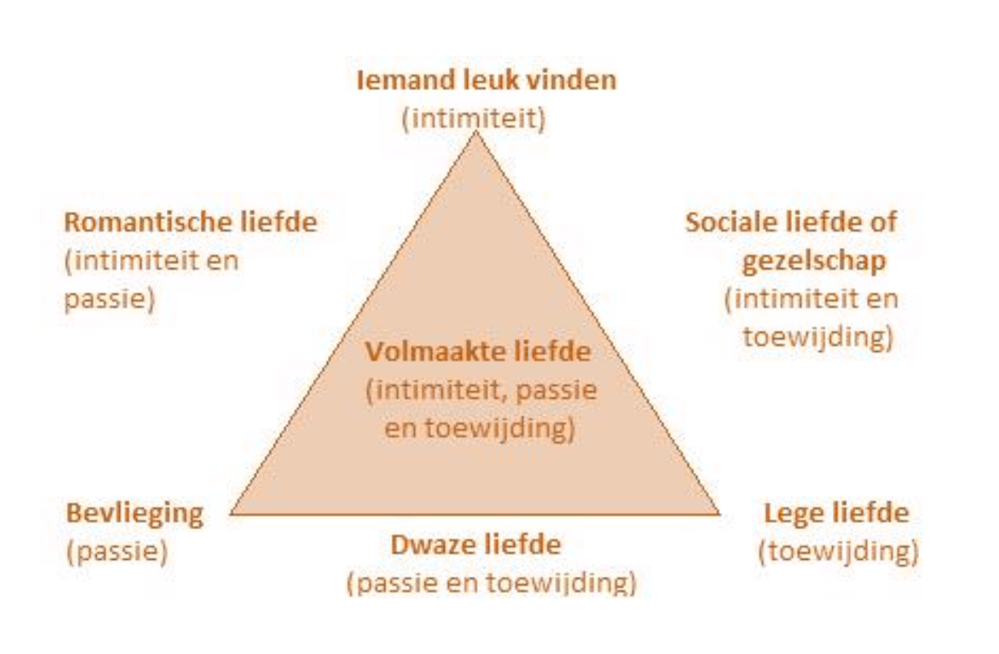
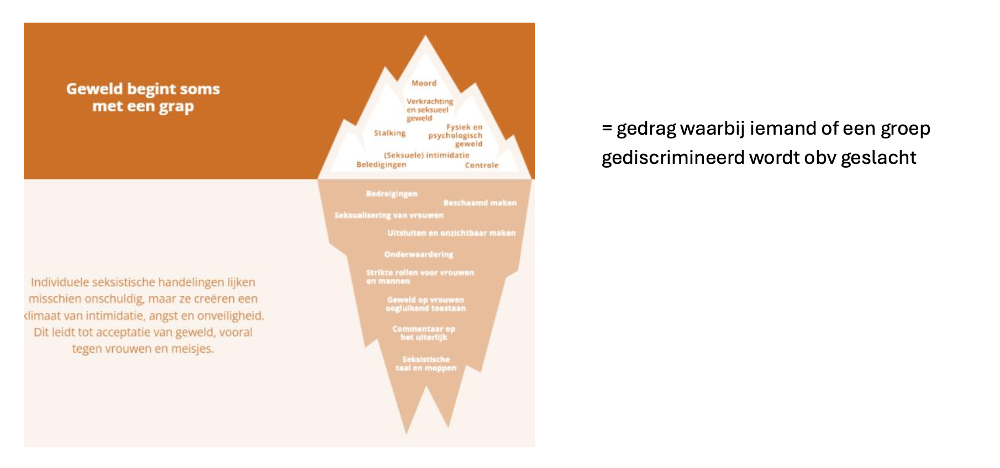

# Life Events — Gecondenseerde Studiegids

> Volledige samenvatting van alle 6 hoorcolleges + digitale tools, per onderwerp.

---

## Inhoudstafel

1. [Hoorcollege 1: Inleiding](#1-hoorcollege-1-inleiding)
2. [Hoorcollege 2: Ouderschap](#2-hoorcollege-2-ouderschap)
3. [Hoorcollege 3: Relaties](#3-hoorcollege-3-relaties)
4. [Hoorcollege 4: School & Werk](#4-hoorcollege-4-school--werk)
5. [Hoorcollege 5: Verlies](#5-hoorcollege-5-verlies)
6. [Hoorcollege 6: Omgaan met Life Events](#6-hoorcollege-6-omgaan-met-life-events)
7. [Digitale Tools](#7-digitale-tools)

---

## 1. Hoorcollege 1: Inleiding

### 1.1 Wat zijn life events?
- Ingrijpende, uitzonderlijke of betekenisvolle gebeurtenissen in iemands leven
- Potentieel destabiliserend; diepgaande invloed op functioneren en welzijn
- **Tools:** SRSS (Social Readjustment Rating Scale), USQ (Undergraduate Stress Questionnaire), LEC-5

### 1.2 Benaderingen
| Benadering | Kern |
|---|---|
| **Biopsychosociaal** | Biologisch + psychologisch + sociaal |
| **Levensloop** | Zelfde gebeurtenis, andere leeftijd = andere impact; cumulatie van stress verzwaart |
| **Existentieel** | Schema's geven betekenis; life event past niet → nieuw betekenisproces (doel, coherentie, waarde) |
| **Maatschappelijk** | Individu ↔ microsysteem ↔ exosysteem ↔ macrosysteem |

### 1.3 Impactfactoren (subjectief!)
- **Levensgeschiedenis:** referentiekader, verwachtingen, coping uit eerdere ervaringen
- **Persoonlijkheid:** filter tussen gebeurtenis en reactie (doeners, gevoeligen, optimisten)
- **Hechtingsstijl** (Bartholomew & Horowitz): model van zelf × model van anderen → **4 hechtingsstijlen** (o.a. angstig: zoekt steun, intens; vermijdend: afstand, emoties onderdrukken)
- **Gezondheidstoestand:** fysiek + mentaal + sociaal welbevinden (WHO); perceptie van gezondheid telt mee

### 1.4 Tools voor welbevinden
**Positieve gezondheid** (6 domeinen): lichaamsfuncties, mentaal welbevinden, zingeving, kwaliteit van leven, meedoen, dagelijks functioneren → spinnenweb

**PERMA (Seligman):** Positive emotions, Engagement, Relationships, Meaning, Achievement → SWB (subjectief welbevinden)

**SWB-theorieën:**
- Set-point theorie: SWB keert terug naar basisniveau
- Affectieve theorie: life events hebben langdurige impact
- Beide vullen elkaar aan
- Kanttekening: te veel positiviteit (euforie) kan nadelig zijn; negatieve emoties zijn soms functioneel
- Positieve gezondheid → spinnenweb toont **sterktes én werkpunten**

**Balkmetafoor:** draaglast (stressoren) vs. draagkracht (coping, steun, energie) → kernidee kwetsbaarheid-stressmodel

### 1.5 Stress
**Definitie:** druk wanneer eisen > aanpassingsvermogen

**Holmes & Rahe (SRRS):** Life Change Units, cumulatief effect. Beperkingen: geen subjectieve interpretatie, culturele verschillen, herinneringsbias

**Lazarus (transactie):** primaire beoordeling (bedreiging/schade/uitdaging?) + secundaire beoordeling (kan ik ermee omgaan?)

**Soorten stressoren:** catastrofes, levensgebeurtenissen, dagelijkse ergernissen

**Werking stress:** stressor (verandering, beheersbaarheid, voorspelbaarheid, ambiguïteit) → **stressysteem** (autonoom zenuwstelsel + **HPA-as**) → stressrespons

**Typen stress:**
| Acuut | Chronisch |
|---|---|
| Kort, intens (rampen, examens) | Langdurig (werkstress) |
| Kan PTSS geven | Kan burn-out geven |

**Eustress vs. distress:** + eustress (positieve spanning) vs. − distress (negatieve spanning)

**Burn-out (Maslach):** emotionele uitputting, depersonalisatie, verminderde prestaties

**Polyvagaal theorie (3 principes):**
1. **Hiërarchie:** ventraal vagale (veiligheid, verbinding) → sympathisch (fight/flight) → dorsaal vagale (freeze/fawn)
2. **Neuroceptie:** onbewuste scan op gevaar/veiligheid
3. **Co-regulatie:** de ander gebruiken om te kalmeren

**Window of tolerance:** hyperarousal ↔ window ↔ hypoarousal

### 1.6 Moderatoren
- **Appraisals:** primair (inschatting situatie) + secundair (hulpbronnen/coping)
- **Attributies:** intern/extern, stabiel/instabiel, globaal/specifiek, controleerbaar/oncontroleerbaar
- **Locus of control:** intern vs. extern (toeval, machtige anderen)
- **Veerkracht:** aanpassingsvermogen na life event; kenmerken: gebalanceerdheid, zinvolheid, doorzettingsvermogen, zelfvertrouwen
- **Diabolomodel veerkracht:** zelfzorg (basis) + zelfontplooiing + verbondenheid (centrale spil)

### 1.7 Stressweerbaarheidsmodel (kwetsbaarheid-stress / diathese-stress)
- Psychische problemen = interactie kwetsbaarheid (diathese) + stress (life events)
- Oorsprong: Zubin & Spring (schizofrenie)
- **Risicofactor ≠ kwetsbaarheid** (risico verhoogt kans; kwetsbaarheid = onderliggend mechanisme)
- **Touwmetafoor:** gewicht = stress; touw kan rekken of breken
- **Risico-veerkrachtmodel:** hoge kwetsbaarheid + hoge stress = ernstiger pathologie
- **G × E × C model** (Schiele): genetics × environment × coping
- Coping is trainbaar (stressmanagement, CGT, zelfmanagement)
- Veerkrachtfactoren o.a.: optimisme, altruïsme, goede copingvaardigheden, sterk sociaal netwerk
- Oudere modellen (ecologisch, genetisch, ontwikkelings-, neurofysiologisch, leermodellen) verklaarden slechts deel van pathologie → kwetsbaarheid als verbindende factor

---

## 2. Hoorcollege 2: Ouderschap

### 2.1 Zwangerschap
**Fysiek per trimester:**
- 1e: ochtendmisselijkheid, neurologische veranderingen (grijze stof ↓, witte stof ↑)
- 2e: zichtbare veranderingen
- 3e: ongemakken, slechtere slaap, verminderde mobiliteit

**Mentaal:** hormonen, identiteitsvragen, impact op partnerrelatie, werk, maatschappij

**Periode rond bevalling:** baby blues, postnatale depressie/angst, postpartum psychose, afscheid nemen van (het beeld van) een kind

### 2.2 Babyblues
- 50–80% vrouwen; **geen aandoening** maar hormonale aanpassing
- Daling progesteron/oestrogeen; piek dag 3–5; normaal weg na 6e week
- Symptomen: stemmingswisselingen, huilbuien, angst, vermoeidheid

### 2.3 Psychische problemen perinataal
- **1/5 vrouwen** heeft psychische problemen tijdens zwangerschap + 1e levensjaar
- Perinatale depressie: 7–15% (zwangerschap), 10% (postpartum); ook bij partners
- Angststoornis: ~13%; OCS: 2,1–2,4% (dwanggedachten beschermen kind, nesteldrang); PTSS: 3–9%; postpartum psychose: 1–2/1000 (75% ongediagnosticeerd, risico herhaling)

### 2.4 Artikel: verlies van een kind (veerkracht gezinnen)
**Klassieke rouwfases:** verdoving → besef → acute rouw → herstelfase

**Modern:** relatie innerlijk reorganiseren, niet volledig loslaten

**Gecompliceerde rouw:** omstandigheden overlijden, leeftijd kind, suïcide, impact op siblings

**Resiliency Model of Family Stress:** beschermende factoren (open communicatie, steun, rituelen) vs. herstelfactoren (hoop, spiritualiteit, betekenisgeving)

**Onderzoek (89 Belgische gezinnen, 3–6 jaar na verlies):**
- 72% noemt communicatie als belangrijkste hulpbron
- Crisis als uitdaging (niet ontkennen) → betere aanpassing
- Formele + informele steun; lotgenotencontact
- Ouders: herdefiniëren; siblings: religieuze/spirituele steun

### 2.5 Groeiende veerkracht perinataal
- **Perinataal/peripartum:** van verlangen zwanger te worden tot 1 jaar na bevalling
- **Matrescentie/patrescentie:** transitie vergelijkbaar met adolescentie
- 3 onderdelen transitie: beeldvorming & verwachtingen, aanpassingsvermogen, engagement
- Protectieve factoren: prenatale screening, kraamzorg, kangoeroezorg, borstvoeding

### 2.6 Eerste 1000 dagen (bevruchting → 2e verjaardag)
- Snelle orgaan-/hersenontwikkeling; extra kwetsbaar
- Invloed op: lichamelijke gezondheid, cognitie, sociaal-emotioneel, school, werk
- Risico's: stress, roken, drugs, geweld, verwaarlozing, armoede
- SES: premature geboorte, laag geboortegewicht, overgewicht
- **Heckman:** investering vroeg > investering later
- **Agentschap Opgroeien:** Kind en Gezin, Groeipakket; onderscheid eerste 1000 dagen vs. **IMH** (Infant Mental Health, tot 5 jaar)
- **PIMH:** perinatale mentale gezondheid ouders + kind

### 2.7 Artikel: gezinsstress & sociaal-emotionele gezondheid kinderen (Amsterdam, 4406 tieners)
- SDQ gemeten; 17% gezinnen met stress; 15,1% kinderen verhoogd risico
- Met stress: 31% problemen vs. zonder: 11,5% → **RR = 2,63**
- Opvoedstress = sterkste impact; cumulatief effect
- Vicieuze cirkel: ouderstress → kindproblemen → meer ouderstress
- JGZ: systematisch bevragen, vroeg ondersteunen

- Spiritualiteit: geloof, kerkgang, graf bezoeken, muziek, natuur, rituelen

### 2.8 Familiereflex (GGZ)
- Familie als gelijkwaardige partner in triade: zorggebruiker – familie – hulpverlener
- Gebaseerd op richtlijn **Steunpunt** Welzijn, Volksgezondheid en Gezin
- **Hulpverleners:** familie onthalen, informeren, ondersteunen, kinderen betrekken, samenwerken tijdens traject; ook bij crisis, suïcide, opname, doorverwijzing/afronding
- **Organisaties:** familiebeleid, familievriendelijke infrastructuur, opleiding, evaluatie, praktische hulpmiddelen
- Beperkingen: focus residentiële zorg, algemene aanbevelingen, weinig innovatie, beperkte aandacht school/werk/buurt
- Implementatie vraagt: shared decision-making, stappenplannen, opleidingen, websites, coaching, tijd en middelen

### 2.9 Grootouder worden
- Combinatie rollen: werk, mantelzorg, opvang kleinkinderen
- Meeste grootouders: wekelijks contact; 1/5 wil vaker; minder contact → vaker wens voor méér contact
- Opvang: gepensioneerden helpen structureler; "back-up" bij ziekte/crèche-sluiting
- Afspraken over opvang, oppasdagen, noodsituaties, taakverdeling tussen grootouderparen
- Evenwicht: betrokken zijn vs. vrijheid; overbevraging (werk + mantelzorg + opvang)
- Genieten omdat: minder opvoedingsverantwoordelijkheid, meer kwaliteitstijd
- Maatschappelijke druk: tussen generaties in; opvoeden vandaag moeilijker (werk-gezin, opvang)

### 2.10 Pleegzorg & adoptie
**Pleegzorg:** 40% aanvragen vindt plaats; ondersteunende pleegzorg; **crisispleegzorg** (binnen 48u, 7/7); perspectief-biedende pleegzorg; pleegzorg volwassenen; **Geef de wereld een (t)huis**

| Risicofactoren | Beschermende factoren |
|---|---|
| Uitstel beslissing terugplaatsing | Snelle, stabiele plaatsing |
| Voortijdige beëindiging/overplaatsing | Ouders accepteren plaatsing |
| Conflicten ouders/pleegouders | Goede samenwerking |
| Negatieve opvoedstrategieën, mishandeling | Autoritatieve stijl, grenzen, steun |
| Onveilige hechting | Veilige hechting, veiligheid in gezin |

**Adoptie gekend kind:** zonder erkende adoptiedienst; voorwaarden: gehuwd/wettelijk samenwonend/min. 3j feitelijk samenwonend of alleenstaand; min. 25j en min. 15j ouder dan kind; programma + geschiktheidsverklaring familierechter

**Adoptie ongekend kind:** kind toegewezen door adoptiedienst

**Adoptie:** gekend kind vs. ongekend kind; interlandelijke adoptie Vlaanderen **definitief stop tegen 2027** (uitdoofscenario; alleen dossiers met concrete match)

### 2.11 Scheiding
**Risico's:** huiselijk geweld, ouderlijke conflicten, psychologische oorlogsvoering, financiële problemen, slechte band met in-/uitwonende ouder

**Beschermend:** humor, genegenheid, goede band met beide ouders, regelmatig contact

**Kinderen nodig hebben:** uitleg, ruimte om te voelen/praten, tijd om te rouwen, conflicten opgelost, gezien worden in krachten

**Ouders nodig hebben:** info/klankbord, niet-veroordelende luisteraar, aandacht voor eigen verdriet

---

## 3. Hoorcollege 3: Relaties

### 3.1 Vriendschappen
- Vrijwillig maar niet vrijblijvend; centraal: vertrouwen, zelfonthulling, steun
- **Levensloop:** kleuters (spelen, wisselend) → lagere school (vertrouwen, gelijkaardige vrienden qua leeftijd/geslacht/etniciteit) → adolescentie (4–6 beste vrienden, intimiteit, loyaliteit, co-ruminatie) → volwassenheid (selectiever) → 65+ (oude vriendschappen, nabijheid)
- **Artikel adolescentievriendschappen:** hechte vriendschappen, **sociale acceptatie & populariteit/likeability** → welzijn later
- Vroege adolescentie → sociale acceptatie voorspelt later welzijn; late adolescentie → hechte vriendschappen
- 70% vriendschapsnetwerken vernieuwt elke 7 jaar (Utrecht); functie verandert (hartsvriend → uitgaansvriend)

### 3.2 Siblings
- Langstdurende relatie; ambivalent (warmte + conflict): vriend/steunfiguur én bron van stress
- Positief: bondgenoot, vertrouwenspersoon; negatief: jaloezie, ruzie, agressie
- Siblinggeweld: vooral tot ~10 jaar; meer bij lagere SES; biologische siblings warmer maar meer conflict; stief-/halfsiblings minder warmte
- **JOP-monitor 2023:** 5463 jongeren, 3795 met sibling; ~1/5 maandelijks/wekelijks conflict; ~5% dagelijks agressie

### 3.3 Partnerrelaties
- Monogaam, polygamie, polyamorie
- **Triangulatietheorie Sternberg:** drie componenten (intimiteit, passie, toewijding) → verschillende liefdesvormen

| Positie | Type liefde | Componenten |
|---|---|---|
| Hoek intimiteit | Iemand leuk vinden | Alleen intimiteit |
| Hoek passie | Bevlieging | Alleen passie |
| Hoek toewijding | Lege liefde | Alleen toewijding |
| Zijde links | Romantische liefde | Intimiteit + passie |
| Zijde rechts | Sociale liefde / gezelschap | Intimiteit + toewijding |
| Zijde onder | Dwaze liefde | Passie + toewijding |
| Midden | Volmaakte liefde | Intimiteit + passie + toewijding |

### 3.4 Discriminatie, racisme, seksisme
**Discriminatie:** ongerechtvaardigd onderscheid op beschermd criterium; oorzaken: socialisatie, ervaring, representatie

**Racisme:** systeem van dominantie en privileges; antiracismewet; micro-agressies

**Seksisme:** = gedrag waarbij iemand of een groep gediscrimineerd wordt obv geslacht

**Kernboodschap:** *Geweld begint soms met een grap.* Individuele seksistische handelingen lijken misschien onschuldig, maar ze creëren een klimaat van intimidatie, angst en onveiligheid. Dit leidt tot acceptatie van geweld, vooral tegen vrouwen en meisjes.

**Ijsberg — boven water (zichtbaar/extreem):** moord, verkrachting en seksueel geweld, stalking, fysiek en psychologisch geweld, (seksuele) intimidatie, beledigingen, controle

**Ijsberg — onder water (genormaliseerd):** bedreigingen, beschaamd maken, seksualisering van vrouwen, uitsluiten en onzichtbaar maken, onderwaardering, strikte rollen voor vrouwen en mannen, geweld op vrouwen oogluikend toestaan, commentaar op het uiterlijk, seksistische taal en moppen

### 3.5 Gender & transgender (artikel)
- Gender = culturele normen rond mannelijkheid/vrouwelijkheid; transgender zijn ≠ psychische aandoening
- Mentale problemen door **minority stress** (discriminatie, stigma, afwijzing)
- Beschermend: pride, community, zelfacceptatie, steunnetwerk, rolmodellen, safe spaces, mindfulness
- Genderbevestigende zorg verbetert mentale gezondheid
- **Genderaffirmatieve benadering:** respect, autonomie, geen gatekeeping
- Consent: angst/depressie ≠ automatisch uitstel; wel bij psychose die begrip verhindert
- Perioperatief: afspraken, wondzorg; roken verhoogt complicaties (necrose, infecties)
- Hormonen behouden bij opname; correcte naam/voornaamwoorden
- Psychotherapie niet verplicht; conversietherapie afwijzen

### 3.6 In-group vs. out-group
- Out-group homogeniteit; contrast vs. assimilatie
- **Centrale vs. perifere route** bij out-group
- **Jane Elliott:** blue eyes/brown eyes → vooroordelen en empathie
- **Minimale groepssituatie:** in-group favoritisme
- **IAT:** bewuste vs. onbewuste attitudes (Gladwell); maatschappelijke beïnvloeding van associaties

### 3.7 Inclusieve zorg (artikel, 19 professionals)
- Kwalitatief verkennend; semigestructureerde interviews (Teams); **sneeuwbalmethode**; **thematische analyse** tot saturatie
- Jongeren met migratieachtergrond: meer discriminatie, minder formele hulp
- **Stagediscriminatie**, microagressies, prestatiedruk
- Cultuursensitieve zorg: herkenning, vertrouwen, empathie, "eerlijke diagnostiek"
- Professionals mét migratieachtergrond: sneller herkenning discriminatie
- School = belangrijke plek vroegdetectie

---

## 4. Hoorcollege 4: School & Werk

### 4.1 Transitie kleuterschool (artikel ECLS-K:2011, 13.390 kinderen)
- Overgangsproblemen (huilen, angst, schoolweigering) voorspellen problemen tot 5e leerjaar
- **Mediatiemodel:** ondersteuning → minder problemen → betere ontwikkeling; **moderatiemodel:** ondersteuning als buffer
- Analyse: padanalyse, **latent class analysis (LCA)**
- 3 schooltypes: minimal (29%), high basic (63%), intensive (9%)
- **High basic supports** (info ouders + klasbezoeken) = meest effectief; kinderen deden het beter academisch
- Intensive supports ≠ beter; geen buffering bij bestaande problemen
- Preventief, niet curatief; eenvoudige maatregelen (communicatie + klasbezoek) volstaan vaak

### 4.2 Lagere school & middelbaar
- Meer structuur: vaste lestijden, stilzitten, huiswerk, evaluaties, minder vrij spel
- Kinderen: langer concentreren, zelfredzaam, agenda beheren
- Context thuissituatie, ouder-kindrelatie altijd meenemen; goed geïnformeerde ouders → vlottere overgang
- Middelbaar: grotere school, moeilijkere stof, zelfstandig plannen, schoolkeuzestress (inschrijvingsbeperkingen Vlaamse steden)

### 4.3 Hoger onderwijs / op kot (Transitions-programma)
- Eenzaamheid, heimwee, stress; meer zelfredzaamheid; identiteitsontwikkeling
- **Transitions:** mental health literacy + life skills; quasi-experimenteel, 2397 studenten, 5 Canadese instellingen
- Onderwerpen: studievaardigheden, stress, seksualiteit, campusondersteuning, hulp zoeken
- Resultaat: meer kennis, minder stigma, minder stress, **2,75× vaker hulp zoeken**
- Beperkingen: geen volledige randomisatie, uitval, weinig diverse populatie
- Flexibel (workshops, online); nuttig in Vlaanderen maar vraagt tijd, begeleiding, financiering

### 4.4 Pesten
- Langetermijnimpact (**National Child Development Study**, UK vanaf 1958: effecten op 50e)
- Definitie: intentioneel, herhaald, machtsonevenwicht
- Cyberpesten: anoniem, altijd zichtbaar, overal mogelijk
- Gevolgen: lager zelfbeeld, sociale angst, minder levenstevredenheid
- **Pabian et al.:** ervaren impact belangrijker dan objectieve ernst; PTG mogelijk
- Vlaamse + Nederlandse steekproef (1010 + 650 jongvolwassenen)

### 4.5 Job, ontslag, werkloosheid
- Jobwissel: onzekerheid maar ook groei; positief als inhoud past
- Ontslag: verlies inkomen, identiteit, structuur, sociale contacten; kan ook opluchting zijn
- Werkloosheid: welbevinden herstelt soms tot 3 jaar; afschrikeffect
- Impact hangt af van inschatting kansen op nieuw werk

### 4.6 Burn-out (Maslach & Leiter)
**3 dimensies:** emotionele uitputting, cynisme/depersonalisatie, verminderde persoonlijke bekwaamheid

**Ontwikkeling:** start vaak als geëngageerde werknemer → overbelasting → uitputting

**6 mismatch-domeinen:** workload, control, reward, community, fairness, values

**Gevolgen:** psychisch (depressie, angst), lichamelijk (slaap, immuunsysteem), werk (absenteïsme), sociaal

**Individueel:** perfectionisme, neuroticisme, lage zelfwaardering, externe locus of control

**Engagement** = positief tegenovergestelde (energie, betrokkenheid, voldoening)

---

## 5. Hoorcollege 5: Verlies

### 5.1 Verlies van een thuis
- Verhuizen = afscheid van herinneringen en hoofdstuk in het leven

### 5.2 Vrijwillige migratie
- Uitdagingen: cultuurshock, taalbarrière, bureaucratie (visum, verzekering), heimwee
- Positief: groei, autonomie, nieuwe contacten
- **EHERO:** migranten ~0,5 punt gelukkiger (schaal 0–10), vooral eerste 5 jaar

### 5.3 Onvrijwillige migratie (artikel Ethiopië)
**Bronnen veerkracht:** sociale steun, werk, onderwijs, religie, gemeenschapsbetrokkenheid

**Opiniestuk "Van energie naar kracht":** energie → frustratie bij gebrek aan kansen; kleinschalige opvang, taal als middel (perfect taalgebruik kan uitsluiten), werk voor integratie

### 5.4 Verhuis naar WZC
- 38% 60-plussers negatief beeld; "laatste halte"; thuiszorg, mantelzorg, trapliften, alarmknoppen
- Verlies: spullen, autonomie, privacy (vaste maaltijden, gedeelde ruimtes); desoriëntatie bij dementie
- Onbegrepen gedrag: weglopen, roepen, agressie
- Familie: schuldgevoel, conflict; culturele verschillen (90% niet-Belgen: zorg voor ouders = morele plicht)
- Individuele + interactionele veerkracht

### 5.5 Ouder worden
- Lichamelijke beperkingen, pensionering (structuur/identiteit verlies), lege nest, overlijden geliefden
- Rouw: ontkenning, verdriet, schuld, angst, eenzaamheid; herhaald verlies op oudere leeftijd

### 5.6 Palliatieve zorg
- Kwaliteit van leven bij levensbedreigende ziekte; dood niet bespoedigen/uitstellen
- Psychosociale behoeften: begrip, acceptatie, zelfrespect, veiligheid/geborgenheid, erbij horen, liefde/aanraking, spiritualiteit, hoop
- **Distress, demoralisatie, angst, depressie** — depressie ≠ normaal onderdeel sterven
- Behandeling: gesprekken, ACT, mindfulness; **levensverhaal**, muziek-/aromatherapie; antidepressiva; kortdurend **benzodiazepines** bij angst
- Barrières herkenning: schaamte patiënt, onvoldoende opleiding hulpverlener; gouden standaard = klinisch gesprek

### 5.7 Afscheid & verlies dierbare
**Levenseinde:**
- A: geen zinloze behandeling starten/voortzetten (therapeutische hardnekkigheid vermijden)
- B: pijnstilling, **palliatieve sedatie** (= verlichten stervenproces)
- C: euthanasie — wilsbekwaam (meerderjarig of **wilsbekwame minderjarige** + toestemming vertegenwoordigers), ondraaglijk lijden, medisch uitzichtloos, schriftelijk verzoek; terminale vs. niet-terminale (2de/3de arts); voorafgaande wilsverklaring alleen bij onomkeerbaar coma
- D: levenseinde zonder wettelijk kader

**Artikel Bonanno et al. (partnerverlies, 205 deelnemers, prospectief):**
| Patroon | % | Kenmerk |
|---|---|---|
| **Resilience** | ~46% | Meest voorkomend; stabiel functioneren |
| Common grief | | Minder vaak dan gedacht |
| Chronic grief | | Sterke afhankelijkheid partner |
| Chronic depression | | Al depressief vóór overlijden |
| Depressed-improved | | Zorg was belastend |
| Delayed grief | | Amper gevonden |

- Weinig zichtbare rouw ≠ koud/ongehecht
- Preloss-factoren cruciaal

---

## 6. Hoorcollege 6: Omgaan met Life Events

### 6.1 AREA-model (Wilson & Gilbert)
**Attent → React → Explain → Adapt**

Betekenisgeving = cruciaal. Factoren: nieuwheid, variatie, onverwachtheid, zekerheid, verklarende coherentie, persoonlijke attributie

### 6.2 Transactionele theorie (Lazarus)
**Primair:** schade/verlies, bedreiging, uitdaging

**Secundair:** interne (zelfvertrouwen) + externe (steun) hulpbronnen

**Smith & Lazarus:** motivationele relevantie, congruentie, verantwoordelijkheid, copingmogelijkheden, toekomstverwachting → emoties

**Voorbeelden primaire beoordeling:** schade (ontslag), bedreiging (examen), uitdaging (nieuwe job)

**Stressvolle gebeurtenissen:** op handen, onverwacht, onvoorspelbaar, onduidelijk, ongewenst, niet controleerbaar, grote levensverandering

**Kritiek:** cirkelredenering, stress ook bij voldoende hulpbronnen; negatieve zelfattributies bemoeilijken verwerking

### 6.3 Sense of Coherence (Antonovsky)
1. **Comprehensibility** (begrijpelijkheid)
2. **Manageability** (hanteerbaarheid)
3. **Meaningfulness** (betekenisvolheid)

### 6.4 Palliatief palet (Portzky)
- Palliatieve activiteit: tijdelijk onderbreken negatieve gevoelens
- Continuüm: positief (sport, hobby) → minder gunstig (dwangmatig) → destructief (alcohol, automutilatie, suïcide)
- **UCL** (Utrechtse Coping Lijst): subschaal palliatief reactiepatroon — mengt positief en destructief
- **P3-schaal:** onderscheid positief/destructief
- Gezond profiel: veel positief, weinig destructief; curve vlak naar einde
- **Borderline:** wisselend patroon — positief bij goed, snel destructief bij verslechtering
- Presenteïsme verhoogt burn-outrisico
- Rouw: ontspanning mag naast verdriet; sociale vs. emotionele eenzaamheid

### 6.5 Coping (Lazarus & Folkman)
| Stijl | Doel |
|---|---|
| Probleemgericht | Stressor aanpakken |
| Emotiegericht | Emoties reguleren |
| Controlegericht | Controle krijgen |
| Vermijdend | Ontsnappen |
| Betekenisgericht | Groei, PTG, nieuwe doelen |

**5 functies (Cohen & Lazarus):** schade verminderen, aanpassen, zelfbeeld behouden, emotioneel evenwicht, relaties behouden

### 6.6 Rouw — modellen

**Kübler-Ross (5 fasen):** ontkenning → protest/woede → onderhandelen → verdriet → aanvaarding
- Kritiek: niet lineair, niet voor iedereen; rouwen is iets wat je leert

**Worden (4 taken):** erkennen, pijn ervaren, aanpassen (nieuwe routines), verbinden (herinneringen bewaren)

**Dual Process Model (Stroebe & Schut):** verliesgerichte ↔ herstelgerichte coping (slingerbeweging); "één been in verlies, één in wereld die doordraait"

**IPM (Guldin & Leget):** 5 dimensies — fysiek, emotioneel, cognitief, sociaal, spiritueel; existentiële spanningen (leven/dood, controle/machteloosheid)

### 6.7 Betekenisgeving (Crystal Park)
- **Global meaning** vs. **situational meaning**
- Stress = discrepantie tussen beide
- Coping via: spiritualiteit, rituelen, tradities, kunst/creativiteit

### 6.8 Sociale steun
- **Materieel:** praktische/financiële hulp
- **Informatief:** advies, informatie
- **Emotioneel:** luisteren, begrip, troost

### 6.9 Herstel (GGZ)
- ≠ genezing; leven met kwetsbaarheid; persoon is expert
- **Verschil veerkracht:** veerkracht = terugveren; herstel = veranderd blijven (knoop in touw)
- **Anthony (1993):** hoop, controle, betekenisvolle participatie
- **4 fasen:** overweldigd → worstelen → leven met → leven voorbij
- **CHIME** (**Leamy** et al., 2011): Connectedness, Hope, Identity, Meaning, Empowerment
- **Thomas meta-analyse (2018):** persoonsgericht herstel → meer herstel, hoop, empowerment; combinatie met ervaringsdeskundigen effectief
- **Empowerment + ervaringsdeskundigheid**

### 6.10 Posttraumatische groei (PTG)
- Positieve verandering na trauma; trauma zelf is niet positief
- **5 domeinen:** relaties, nieuwe mogelijkheden, persoonlijke kracht, spiritualiteit, waardering leven
- PTG ≠ veerkracht (PTG = hoger niveau dan vóór)

---

## 7. Digitale Tools

### Ouderschap
| Tool | Doel |
|---|---|
| perinatalehulp.be/zelfhulp | Depressie na zwangerschap; traject ~10 weken; iemand uit omgeving betrekken |
| kinderwens.org/vanrozenaarbrozewolk | Veerkracht jonge ouders (**1001 dagen**) |
| wolkinmijnhoofd.be | Mentale gezondheid zwangerschap–1 jaar postpartum |
| vaderen.be | Vaderschap 0–8 jaar |
| Keep in Touch Kit (app) | Gescheiden gezinnen; kalender, checklists, chatroom |
| scheidingskoffer.be | Scheiding; reflectievragen, tips, liedjes |
| steunpuntadoptie.webinargeek.com | Adoptie webinars |
| a-buddy.be | Lotgenoten geadopteerden |
| zojong.be | Mantelzorgers |
| druglijn.be/grip | KOPP-kinderen |

### Relaties
| Tool | Doel |
|---|---|
| vragenlijsten.mijnpositievegezondheid.nl | Positieve gezondheid spinnenweb (6 domeinen) |
| samenveerkrachtig.be | GGZ-veerkracht (oktober + het hele jaar) |
| reacttoracism.be | Racisme & veerkracht |
| kennispleingehandicaptensector.nl | Handicap & veerkracht |
| noknok.be | Jongeren 12–16 jaar |

### School & Werk
| Tool | Doel |
|---|---|
| moodspace.be | Studentenwelzijn; **aanrader examenperiode** |
| allesoverpesten.be | Pesten |
| pimento.be | Hulpverleners + pesten |
| vrt.be/edubox | Online pesten |
| tegek.be | Burn-out psycho-educatie |
| geluksdriehoek.be | Geluk (zijn, voelen, omringd) |

### Verlies
| Tool | Doel |
|---|---|
| waarblijftmijntijd.mantelzorg.nl | Mantelzorgtijd |
| mijnherinneringaanjou.be | Digitale herinneringen overledene |
| missingyou.be | Rouw jongeren/jongvolwassenen |
| onlinehulp-apps.be/rouwkost | Rouw psycho-educatie; normale rouw of aanvulling op begeleiding |
| bovendewolken.be | Foto's sterrenkinderen |

---

## Snelle examenchecklist

- [ ] Life events = subjectief; benaderingen kennen
- [ ] SRSS, PERMA, positieve gezondheid, balkmetafoor
- [ ] Lazarus (primair/secundair), polyvagaal, window of tolerance
- [ ] Kwetsbaarheid-stressmodel, G×E×C, diabolomodel veerkracht
- [ ] Perinataal: babyblues vs. depressie; eerste 1000 dagen; Familiereflex
- [ ] Vriendschappen levensloop; siblings; gender/TGD; inclusieve zorg
- [ ] Schooltransities; Transitions-programma; pesten (Pabian); burn-out (6 domeinen)
- [ ] Migratie vrijwillig/onvrijwillig; WZC; palliatief; euthanasie-voorwaarden
- [ ] Bonanno rouwpatronen; AREA; SOC; palliatief palet; rouwmodellen
- [ ] Herstel vs. veerkracht; CHIME; PTG (5 domeinen)
- [ ] Digitale tools per hoorcollege
